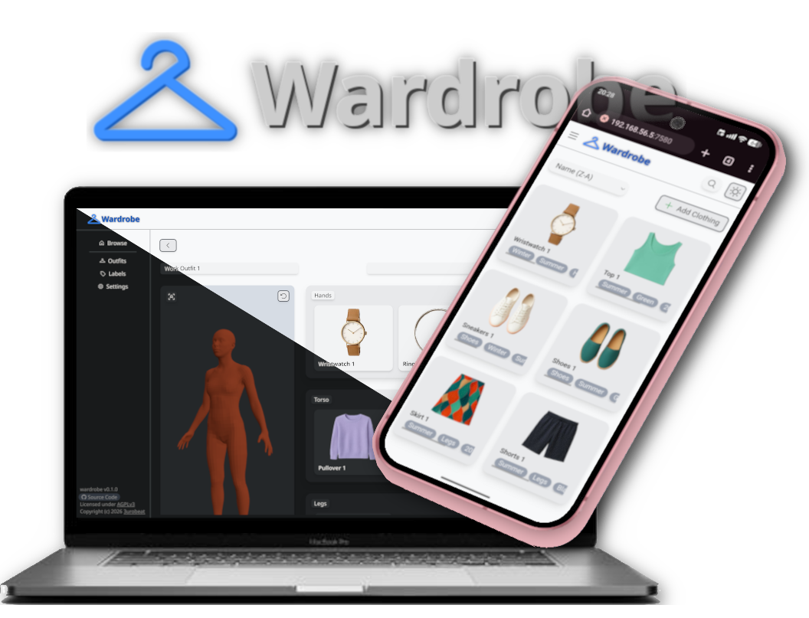

<div align="center">
    <p align="center"></p>
    <h4>👚 Selfhosted clothing management web app for your personal wardrobe or commercial store!</h4>
    <div>
        <a href="#introduction">Introduction</a> •
        <a href="#installation">Installation</a> •
        <a href="#getting-started">Getting Started</a> •
        <a href="#other">Other</a>
    </div>
    <!--  -->
</div>

&nbsp;

<a id="introduction"></a>

# ✨ Introduction
Wardrobe is a selfhosted, *non-vibe-coded* clothing & outfit management web application.  

Do you also have a lot of clothes, still struggle to decide what to wear and even sometimes forget about some?  
Then this is for you! *...and me, cause this was the motivation behind building it*

Wardrobe features:
- **Add your Clothes**
  - with: Image, Title, Description, Labels
- **Create Outfits:** Combine your Clothes!
  - with: Clothes per body part, Title, Labels
  - Automatically generated preview image based on clothes added
- **Browse your Clothes & Outfits**
  - What do I want to wear today?
  - Search by text, sort by name/date or filter by a combination of labels
  - Upcoming: Get recommendations based on your local weather & outfit labels
- **Create Labels & Label Categories**
  - Keep it organized: Each label has a category
  - Keep it *re*organized: Reorder your labels by dragging to sort them by relevancy
  - Comes pre-configured with labels for type, season, year, color & body part to get you started

...and more to come!

&nbsp;

<a id="installation"></a>

# 🛠️ Installation
System Requirements: Next to none.

## Docker (recommended):
```bash
# Create a volume for wardrobe to store your data in:
docker volume create wardrobe-data

# Run the container - Replace <host_port> with the port you want to access wardrobe at
docker run -p <host_port>:3000 -v wardrobe-data:/usr/src/wardrobe/data 3urobeat/wardrobe:latest
```

> [!NOTE]
> If you are using Portainer, make sure to set the working directory at the bottom to `/usr/src/wardrobe`

<br>

<details>
  <summary><strong>Method 2: Local Install</strong> (Click to unfold)</summary>

  Make sure you have git, node & npm installed on your system.

  ```bash
  # Clone the git repository:
  git clone https://github.com/3urobeat/wardrobe
  cd wardrobe

  # Install dependencies:
  npm ci --omit=dev

  # Build the project:
  npm run build

  # Start the service:
  PORT=<host_port> npm run start

  # Replace <host_port> with the port you want to access wardrobe at.
  # If you omit 'PORT=', port 3000 will be used.
  ```

</details>

&nbsp;

> [!IMPORTANT]  
> No matter which method you chose, make sure to protect the service!  
> Wardrobe does not provide any authentication itself and I do not guarantee any security.  
> Either use a 3rdParty auth service, enable password protection in your reverse proxy, put it behind a VPN or don't expose it to the outside at all.

&nbsp;

<a id="getting-started"></a>

# 🚀 Getting Started
After starting the service, access wardrobe in your browser using the IP of your host and the port you specified above.  
Assuming you started the project on your current device using the default port 3000, open: `http://localhost:3000`

You will be greeted by an empty clothes browse page!

<br>

**Clothes:**  
Start by adding a few of your clothes by clicking the "+ Add Clothing button".  
- Take and upload a picture of your piece of clothing hanging behind or lying on a neutral background
- Give your piece of clothing a fitting name
- Select a few fitting labels from the pre-configured list 
  - Make sure to select a body part label to be able to find it in the outfit editor!
- Save!

<br>

**Outfits:**  
You can now create an outfit using the clothes you've added.  
Switch to the "Outfits" menu using the nav bar on the left side and click "+ Add Outfit".
- Select a fitting piece of clothing for each body part from the clothing picker by clicking on "+"
- Give your new outfit a fitting name at the top left
- Select a few fitting labels from the pre-configured popout-list at the top right by clicking on "v"
- Save!

<br>

**Labels:**  
Lastly, check out the labels menu:  
This menu allows you to add categories, which hold the labels you've already seen, to categorize and filter your clothing collection.

Categories may be configured to have a speciality, which unlocks another setting field for each label.  
Besides the already discovered body part speciality, you can also configure a color and a date/temperature range to wear that piece of clothing/outfit using the Season speciality.

&nbsp;

<a id="other"></a>

# 📝 Other
## Contribution
Every contribution is welcome!  
Please see [CONTRIBUTING.md](/CONTRIBUTING.md).

## License
This project is licensed under the Open Source Copyleft AGPL-3.0 license.  
Please see [LICENSE](/LICENSE).

## Icons
SVG Icons, including the favicon, were taken from [Phosphor Icons](https://phosphoricons.com/).  
All their icons are licensed under the [MIT](https://raw.githubusercontent.com/phosphor-icons/homepage/master/LICENSE) license.

## 3D Model
Modified version of the Human Base Mesh from [Blender.org](https://www.blender.org/download/demo-files/).  
The original is licensed under the CC0 license.  
Please see [resources/3d-model/](/resources/3d-model/).
